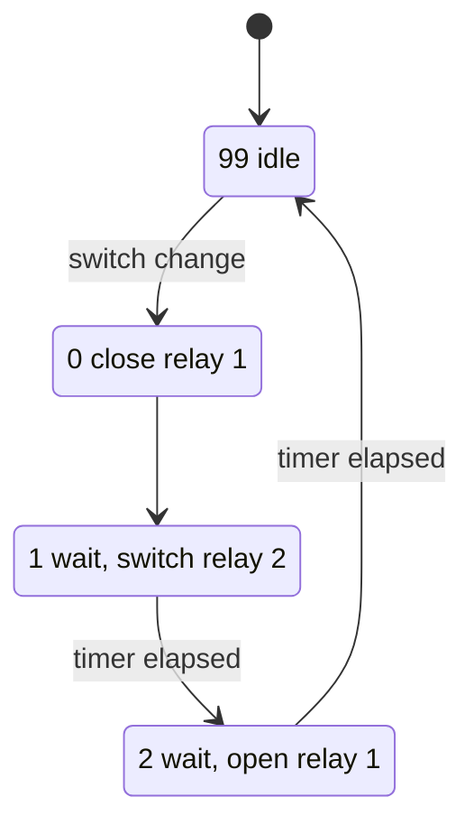

# Skateboard Power Controller

[](https://doi.org/10.5281/zenodo.22991113) [](https://github.com/josto-me/skateboard-power-controller/actions/workflows/build.yml) [](LICENSE) [](LICENSE-CC-BY-4.0.txt) [](CITATION.cff)

Ansteuerung für ein Elektro-Skateboard.

Small AVR (ATtiny) power controller for an electric skateboard. A switch on the handle
turns the board on and off; the controller switches two relays (a main relay and an aux
relay) in a fixed order. The sequence is read as a precharge / arc-bypass circuit
(hypothesis, see [`docs/precharge.md`](docs/precharge.md)). Version 2 adds a 4-LED
battery gauge and a piezo low-voltage alarm.

## Safety and disclaimer

This is a hobby project, not a certified product. Battery packs of electric skateboards store a lot of energy; short circuits, wrong wiring or failing relays can cause fire, injury and damage, and a loss of motor power while riding can cause a fall. Anyone building on this work does so at their own risk and is responsible for the safety of the board and for local regulations. No warranty, see the licenses.

## What it is

Two firmware versions:

- **v1** (ATtiny13) – the basic relay sequencer: debounced switch, two relays, a status
  LED. No battery measurement.
- **v2** (ATtiny26) – adds an ADC0 battery divider, a 4-LED gauge (green / 2× yellow /
  red), a "show battery" button and a piezo that warns on low voltage.

Both use a periodic timer tick that drives all software timers, `switch`-based state
machines and direct register access, with no blocking delays.

## Hardware

| | v1 | v2 |
|---|---|---|
| MCU | ATtiny13 | ATtiny26 |
| Clock | internal RC, 9.6 MHz | internal RC, 8 MHz |
| Tick | Timer0 CTC, 25 ms | Timer0 overflow, ~8.19 ms |
| Key switch | PB0 (pull-up) | PB0 (pull-up) |
| Relays | PB2, PB3 | PB2, PB3 |
| Battery gauge | – | PB4/PB5/PB6 + PA7, ADC0 (PA0) |
| Piezo | – (PB1 = status LED) | PB1 |
| Show-battery button | – | PA6 (pull-up) |

Full table with directions and notes: [`docs/pinout.md`](docs/pinout.md). The timing
constants are calculated for the clocks in the table; with another clock the tick and
all delays change.

## How it works

On switch-on the relays are driven in order: relay 1 close → wait → relay 2 close →
wait → relay 1 open (end state: relay 2 closed). On switch-off: relay 1 close → wait →
relay 2 open → wait → relay 1 open. Waveforms and the state machine are in
[`docs/timing-and-states.md`](docs/timing-and-states.md); the precharge explanation is in
[`docs/precharge.md`](docs/precharge.md).



v2 measures the battery every 500 ms, shows the level on the LED bar with hysteresis and,
on undervoltage, blinks the red LED and sounds the piezo. The relays stay as they are:
the motor power is never cut while riding.

### v2 battery monitoring

- One discarded ADC conversion runs during init, so `ADCH` is valid on the first read
  and there is no false alarm at power-up.
- The LED level changes only after the measured voltage crosses a threshold by
  `VOLTAGE_HYST` (directional hysteresis, no flicker at the thresholds).
- Low-voltage warning only: red LED blinks and the piezo sounds, the relays are not
  switched. All thresholds are on the divided measurement voltage.

## Contents

```
firmware/v1/              v1 (ATtiny13) + its README
firmware/v2/              v2 (ATtiny26)
docs/pinout.md            pin tables (v1 and v2)
docs/block-diagram.md     block diagram (Mermaid)
docs/timing-and-states.md relay timing + state-machine diagrams
docs/precharge.md         precharge / inrush explanation
```

## Build

- Toolchain: avr-gcc and avr-libc.
- MCU: ATtiny13 (v1) / ATtiny26 (v2).
- Clock: internal RC, 9.6 MHz (v1) / 8 MHz (v2). Set the fuses to match.
- Before connecting the power stage, check the relay step delays on PB2/PB3 with a scope.

```
avr-g++ -mmcu=attiny13 -DF_CPU=9600000UL -Os -o v1.elf firmware/v1/Skateboard_Power_V1.cpp
avr-g++ -mmcu=attiny26 -DF_CPU=8000000UL -Os -o v2.elf firmware/v2/Skateboard_Power_V2.cpp
```

## License

- Code in `firmware/`: **Apache License 2.0**, see [`LICENSE`](LICENSE) and [`NOTICE`](NOTICE).
- `docs/` and the README: **CC BY 4.0**, see [`LICENSE-CC-BY-4.0.txt`](LICENSE-CC-BY-4.0.txt).

You may use, change and share everything, also commercially. When you pass it on or
publish something based on it, credit it as:

> Johannes Stockhammer, "Skateboard Power Controller", version 1.0.0, Zenodo, https://doi.org/10.5281/zenodo.22991114

GitHub shows the same citation under "Cite this repository" (from [`CITATION.cff`](CITATION.cff)).

## Dependencies

Needed to build: avr-gcc and avr-libc (modified BSD).

## Trademarks

Atmel and AVR are trademarks of their respective owners, used only to identify the hardware.

## Author

Johannes Stockhammer

Concept, hardware and original firmware by Johannes Stockhammer. Translation, code revision (Timer0 port of v1 to the ATtiny13, hysteresis of the battery gauge, discarded first ADC conversion) and the documentation were done with the help of AI tools and reviewed by the author.
