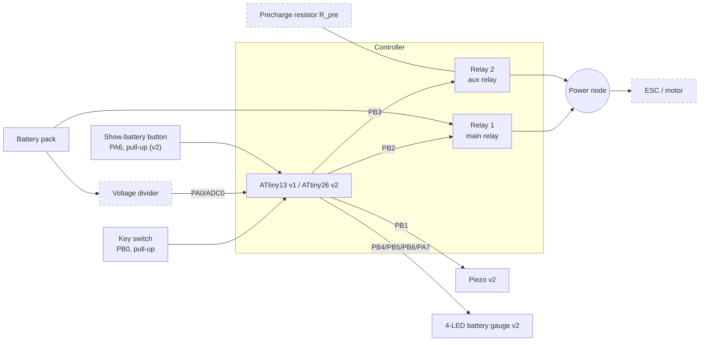

# Block diagram

The controller part follows from the firmware. The power path (precharge resistor, how
the relays bypass it, the ESC/motor) follows the precharge hypothesis in
[`precharge.md`](precharge.md). No component values are given.

Dashed boxes (precharge resistor, divider ratio, ESC/motor) are not defined by the
firmware. How relay 2 and the precharge resistor sit relative to relay 1 depends on the
wiring — see [`precharge.md`](precharge.md).

- **v1** uses only the key switch, the two relays and a status LED on PB1.
- **v2** adds the ADC0 divider, the 4-LED gauge, the piezo and the show-battery button.
