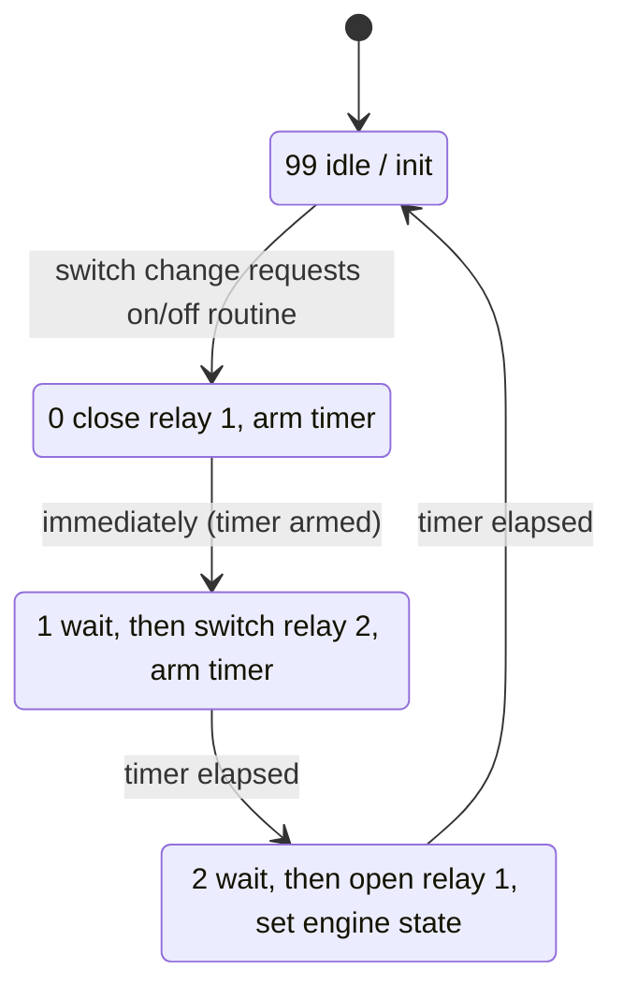

# Relay timing and state machine

## Relay sequences

Both relays are active-high in the firmware (`PORTB |= …` closes, `&= ~…` opens). The
step wait is ~2 s in v1 (`TIME_RELAY = 2 s`) and ~0.5 s in v2 (`TIME_RELAY = 500 ms`);
`Δt` below stands for that wait.

### Switch-on sequence

```
Relay 1  ____|‾‾‾‾‾‾‾‾‾‾‾‾‾|________      close, wait Δt … then open at the end
Relay 2  ______________|‾‾‾‾‾‾‾‾‾‾‾‾      close after Δt, stays closed
         |    Δt       |    Δt      |
         close R1   close R2     open R1
```

Result after switch-on: **relay 2 closed, relay 1 open.**

### Switch-off sequence

```
Relay 1  ____|‾‾‾‾‾‾‾‾‾‾‾‾‾|________      close, wait Δt … then open at the end
Relay 2  ‾‾‾‾‾‾‾‾‾‾‾‾‾|____________      open after Δt
         |    Δt       |    Δt      |
         close R1    open R2     open R1
```

Result after switch-off: **both relays open.**

The pattern: bring relay 1 in to carry current, then move relay 2, then drop relay 1
(see [`precharge.md`](precharge.md)).

## State machine (both on- and off-routine)

`state` runs 0 → 1 → 2 → 99, where 99 is the idle/init value. The main loop starts a
routine by setting its state to 0 only when both routines are idle.



The on-routine's step 1 **closes** relay 2 and step 2 sets `engine_state = ON`; the
off-routine's step 1 **opens** relay 2 and step 2 sets `engine_state = OFF`.

In v2 undervoltage only raises an alarm; it never starts the off-routine.

## Battery gauge (v2)

The measured (divided) voltage maps to five levels with directional hysteresis
(`VOLTAGE_HYST`):

| Level | Divided voltage | LEDs |
|---|---|---|
| 4 | > 4 V | green + 2× yellow + red |
| 3 | 3–4 V | 2× yellow + red |
| 2 | 2–3 V | 1× yellow + red |
| 1 | 1–2 V | red only |
| alarm | < 1 V | red blinks + piezo (relays unchanged) |

The gauge shows while riding (`switch on`) or when the show-battery button (PA6) is held
while idle; otherwise the LEDs are off. The alarm is always active regardless of the
button.
